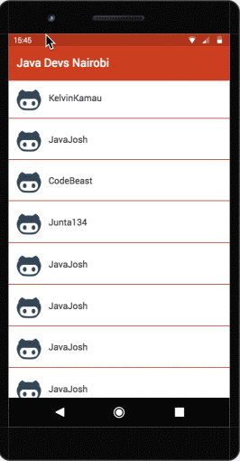
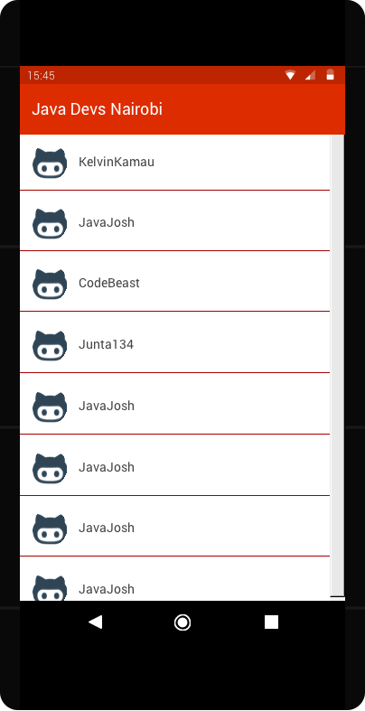
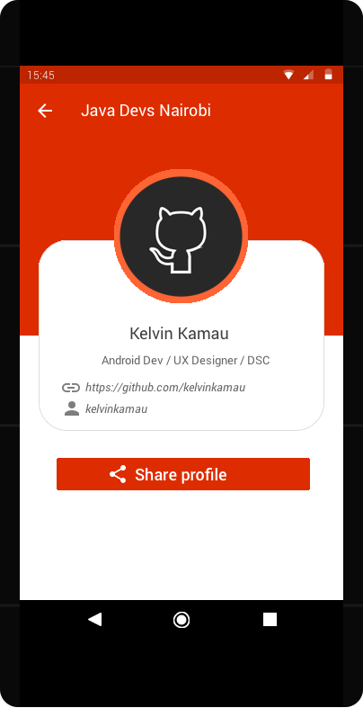
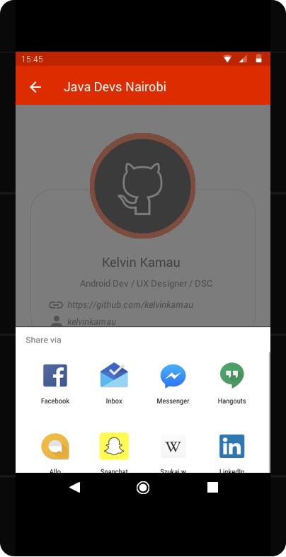

# javadevnairobi

An android app that shows Java Developers in Nairobi

## UI Mock ups
 The Java Devs Nairobi has these screens:

#### Mockup animation
 

#### List of developers
   

#### Profile of Single Developer
   

#### Share Profile Intent Chooser
 

